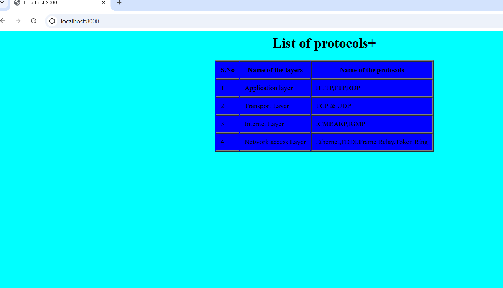

# EX01 Developing a Simple Webserver
## Date: 06.09.2025

## AIM:
To develop a simple webserver to serve html pages and display the list of protocols in TCP/IP Protocol Suite.

## DESIGN STEPS:
### Step 1: 
HTML content creation.

### Step 2:
Design of webserver workflow.

### Step 3:
Implementation using Python code.

### Step 4:
Import the necessary modules.

### Step 5:
Define a custom request handler.

### Step 6:
Start an HTTP server on a specific port.

### Step 7:
Run the Python script to serve web pages.

### Step 8:
Serve the HTML pages.

### Step 9:
Start the server script and check for errors.

### Step 10:
Open a browser and navigate to http://127.0.0.1:8000 (or the assigned port).

## PROGRAM:
```
from http.server import HTTPServer, BaseHTTPRequestHandler

content = '''
<HTML>
    <HEAD>
    </HEAD>
    <BODY bgcolor="cyan">
        <table border="1" align="center" bgcolor="blue" cellpadding="10"
        <caption><h1><center>List of protocols+</center></h1></caption>
        <tr><th>S.No</th><th>Name of the layers</th>
        <th>Name of the protocols</th>
    </tr>
    <tr>
        <td>1</td><td>Application layer</td><td>HTTP,FTP,RDP</td>
    </tr>
    <tr>
        <td>2</td><td>Transport Layer</td><td>TCP & UDP</td>
    </tr>
    <tr>
        <td>3</td><td>Internet Layer</td><td>ICMP,ARP,IGMP</td>
    </tr>
    <tr>
        <td>4</td><td>Network access Layer</td><td>Ethernet,FDDI,Frame Relay,Token Ring</td>
    </tr>
    </table>
    </BODY>
</HTML>
'''

class MyServer(BaseHTTPRequestHandler):
    def do_GET(self):
        print("Get request received...")
        self.send_response(200) 
        self.send_header("content-type", "text/html")       
        self.end_headers()
        self.wfile.write(content.encode())

print("This is my webserver") 
server_address =(' ',8000)
httpd = HTTPServer(server_address,MyServer)
httpd.serve_forever()
```

## OUTPUT:


## RESULT:
The program for implementing simple webserver is executed successfully.
